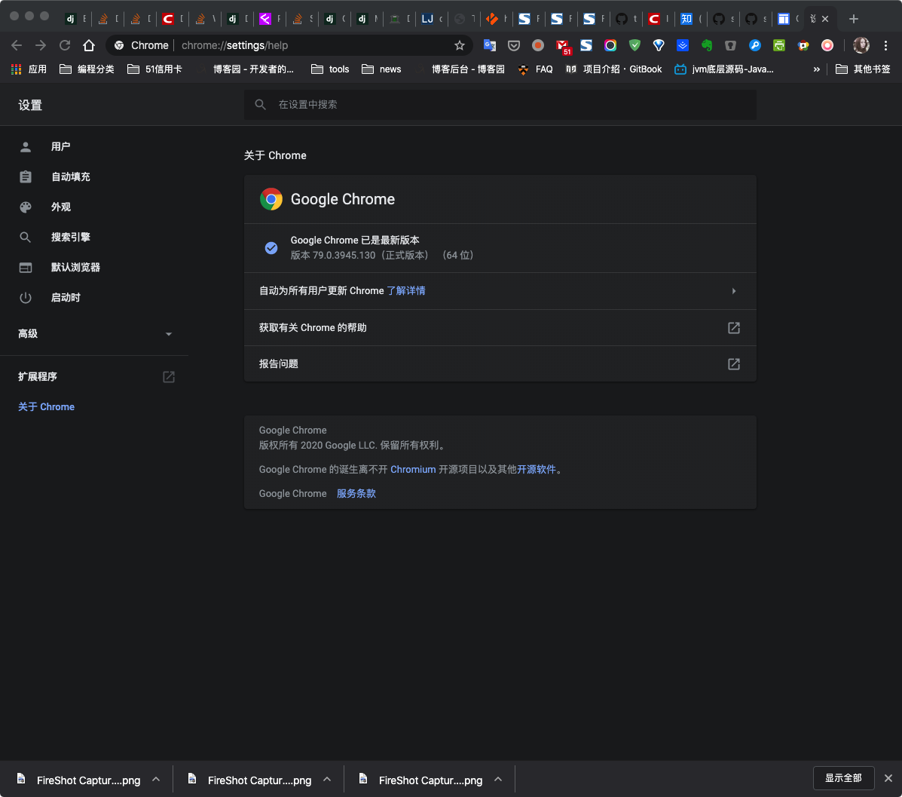
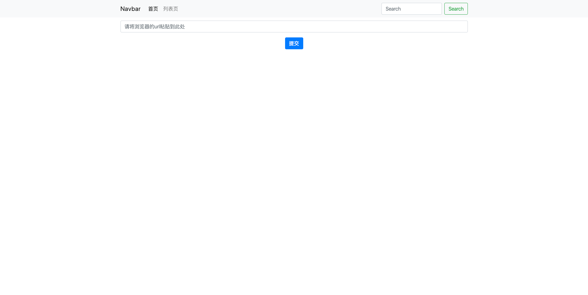
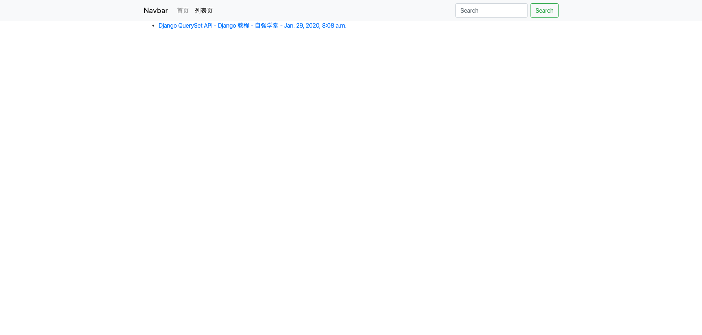
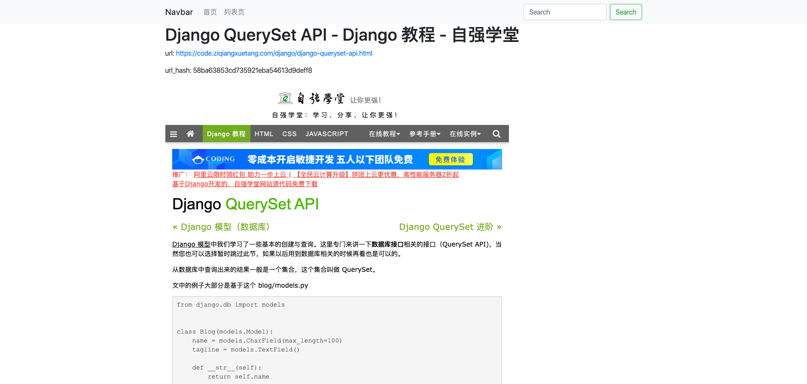

# Online Snapshot

[](https://github.com/RichardLitt/standard-readme)

This project can help you snapshot a website by providing an url.  You can learn how to build such a simple website using Django and Bootstrap.

## Table of Contents

- [Background](#background)
- [Install](#install)
- [Usage](#usage)
- [Maintainers](#maintainers)
- [Contributing](#contributing)
- [License](#license)

## Background

I want a tool that can help me snapshot the web page and manage these snapshots. So I took a half day to develop this simple project. This is just for fun because i know it will take a lot of time to build a perfect tool. If no perfect tool can be found, maybe I will continue to develop this project.  

## Install

You need to download the chrome driver from [https://chromedriver.chromium.org/](https://chromedriver.chromium.org/).  The version of chrome driver should match the version of Chrome which you can find by typing `chrome://settings/help` in the address line in Chrome.



Then change the CHROME_DRIVE to the path you put the chrome driver in the `autosnap/settings.py`.

```python
CHROME_DRIVE = r"/Users/textworld/bin/chromedriver" # the bottom of file
```

Next, you need install Django(>=3.0.2). Google it if you don't know how.

## Usage

After you run server, there are 3 pages in this website.







First paste the url in the index page. Then click the submit button and wait for a few seconds. Then the browser will navigate you to the detail page. You will see the title, the url and an snapshot image.  

## Maintainers

[@textworld](https://github.com/textworld).

## Contributing

Feel free to dive in! [Open an issue](https://github.com/RichardLitt/standard-readme/issues/new) or submit PRs.

Standard Readme follows the [Contributor Covenant](http://contributor-covenant.org/version/1/3/0/) Code of Conduct.

### Contributors

Welcome to make contributes to this project.


## License

[MIT](LICENSE) © Richard Littauer
